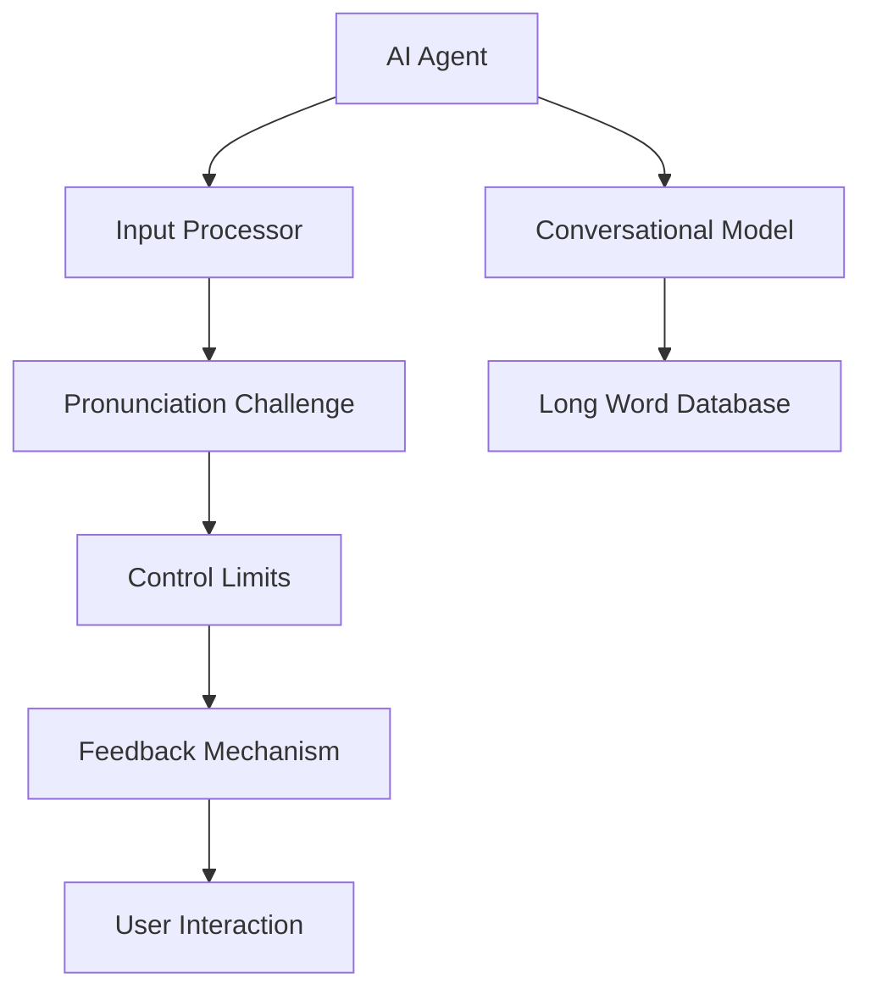

# Architecture Overview

```mermaid
graph TD;
    A[AI Agent] --> B[Input Processor];
    B --> C[Pronunciation Challenge];
    C --> D[Control Limits];
    D --> E[Feedback Mechanism];
    A --> F[Conversational Model];
    F --> G[Long Word Database];
    E --> H[User Interaction];
```
